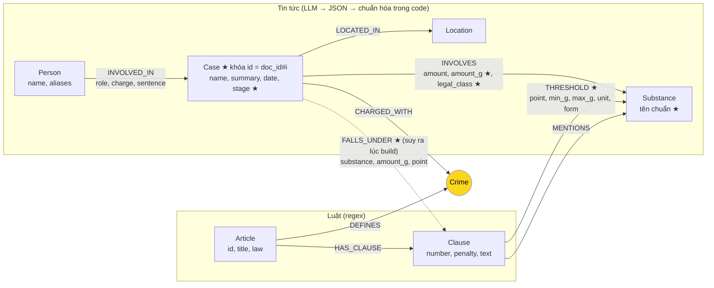

# Thiết kế Ontology — Day 19

**Họ tên:** Phạm Cường Quốc  **MSSV:** 2A202602469

**Lựa chọn** (đánh dấu một):
- [ ] Dùng ontology gợi ý (có thể chỉnh nhỏ)
- [x] Tự thiết kế (xét bonus +15, xem `SUBMISSION.md`)

> Code: `src/graph.py`. Mặc định dựng ontology này; đặt biến môi trường `KG_ONTOLOGY=hint` để dựng lại ontology gợi ý làm mốc so sánh (`ket_qua_benchmark_kg.hint.txt`).

## 1. Sơ đồ

Các phần đánh dấu ★ là chỗ khác ontology gợi ý.

Node cầu nối chính: **`Crime`**. Cầu nối phụ: **`Substance`** (luật nói ngưỡng khối lượng của chất, tin nói vụ án có bao nhiêu gam chất đó), và cạnh suy ra **`FALLS_UNDER`** nối thẳng `Case` sang đúng `Clause`.

## 2. Entity types (node labels)

| Label | Ý nghĩa | Khóa định danh (`MERGE` theo) | Properties | Lấy từ KB nào | Trích bằng (regex / LLM / khác) |
| --- | --- | --- | --- | --- | --- |
| `Article` | Một Điều luật | `id` ("Điều 251 BLHS") | `title`, `law`, `doc_id` | Luật | regex trên front matter |
| `Clause` | Một khoản của Điều, một khung hình phạt | `id` ("Điều 251 BLHS khoản 1") | `number`, `penalty`, `text`, `doc_id` | Luật | regex `^\d+\.` + regex câu "bị phạt …" |
| `Crime` | Tội danh (cầu nối) | `name` đã chuẩn hóa (`normalize_crime`) | `name` | Luật (tiêu đề Điều); tin map vào qua `link_entity` | regex + `link_entity` |
| `Substance` | Chất ma túy, theo **tên chuẩn** | `name` chuẩn (`canonical_substance`) | `name` | Cả hai | luật: `find_substances` + regex ngưỡng; tin: LLM rồi bảng đồng nghĩa + `link_entity` |
| `Case` | Một vụ việc được một bài báo tường thuật | `id` = `"<doc_id>#<thứ tự>"` | `name`, `summary`, `date`, `stage`, `doc_id`, `source_title` | Tin | LLM (JSON mode) |
| `Person` | Bị cáo, bị can, cán bộ… | `name` (bỏ biệt danh/tuổi trong ngoặc, gộp khoảng trắng, NFC) | `name`, `aliases` (hợp nhất qua các bài) | Tin | LLM + chuẩn hóa trong code |
| `Location` | Tỉnh/thành nơi xảy ra | `name` | `name` | Tin | LLM |

`Substance` có thêm hai node "loại pháp lý" lấy từ luật: `Chất ma túy khác (thể rắn)` và `Chất ma túy khác (thể lỏng)`. BLHS không nêu tên Ketamine, nên Ketamine được xếp vào `Chất ma túy khác (thể rắn)`.

## 3. Relationships

| Type | Từ → Đến | Properties trên cạnh | Ý nghĩa |
| --- | --- | --- | --- |
| `DEFINES` | Article → Crime | – | Điều luật định nghĩa tội |
| `HAS_CLAUSE` | Article → Clause | – | Điều có khoản |
| `THRESHOLD` ★ | Clause → Substance | `point` (điểm a, b…), `min_g`, `max_g` (null = "trở lên"), `unit` (g/ml), `form` (nguyên văn dạng chất) | Khoản áp dụng khi chất ở trong khoảng khối lượng này |
| `MENTIONS` | Clause → Substance | – | Khoản nhắc tới chất nhưng không kèm ngưỡng |
| `CHARGED_WITH` | Case → Crime | – | Vụ bị khởi tố/truy tố/xét xử về tội này |
| `INVOLVES` | Case → Substance | `amount` (nguyên văn), `amount_g` ★ (số gam, parse trong code), `legal_class` ★ | Vụ liên quan chất, bao nhiêu |
| `LOCATED_IN` | Case → Location | – | Nơi xảy ra |
| `INVOLVED_IN` | Person → Case | `role`, `charge`, `sentence` | Vai trò, tội danh, mức án **của người đó trong vụ đó** |
| `FALLS_UNDER` ★ | Case → Clause | `substance`, `amount`, `amount_g`, `point`, `min_g`, `max_g`, `form` | Cạnh **suy ra** lúc build: khối lượng chất của vụ rơi vào khoảng của khoản nào trong Điều tương ứng tội danh |

Mức án là **property của cạnh `INVOLVED_IN`**, không phải node: một mức án chỉ có nghĩa với một người trong một vụ, không ai truy vấn "tất cả các vụ bị 36 tháng tù".

## 4. Node cầu nối giữa 2 KB

- **Node nào:** `Crime`. Cầu nối phụ là `Substance`; `FALLS_UNDER` là đường tắt được tính sẵn đi qua cả hai cầu.
- **Vì sao chọn node này:** câu hỏi xuyên KB luôn có dạng "người/vụ → tội gì → Điều nào → khung nào". Tội danh là thứ duy nhất **cả hai** KB đều gọi tên: luật ở tiêu đề Điều, báo ở câu "bị tuyên … về tội …". Chất ma túy cũng xuất hiện ở cả hai, nhưng một mình nó không xác định được Điều (MDMA có trong Điều 248–252), nên nó chỉ dùng để chọn **khoản** sau khi đã có Điều.
- **Cách đảm bảo hai phía khớp tên:**
  1. Danh sách tên tội chuẩn (13 tội, lấy từ tiêu đề Điều bằng regex) được đưa vào prompt trích xuất, kèm yêu cầu chọn nguyên văn.
  2. Kết quả LLM vẫn đi qua `link_entity`: `normalize_crime` (chữ thường, bỏ "Tội ", gộp khoảng trắng), khớp chính xác, rồi `difflib` cutoff 0,8. Cách này bắt được "ma tuý"/"ma túy" và chữ hoa. Không đủ giống thì bỏ, không nối bừa.
  3. Chất: bảng đồng nghĩa (`ma túy đá` → Methamphetamine, `thuốc lắc` → MDMA, `ketamin` → Ketamine…), rồi `link_entity` với `normalize_substance` (NFC + chữ thường).
- **Khi nào cầu gãy, và bạn xử lý thế nào:**
  - Bài báo chỉ nói "bắt giữ", "điều tra" mà chưa nêu tội danh, nên LLM để trống `charges`. Case khi đó không có `CHARGED_WITH`. `context()` vẫn đưa tóm tắt vụ, và các Điều mà vector search tìm thấy vẫn được thêm qua seed `Article`, nên LLM trả lời vẫn có căn cứ luật.
  - Báo dùng hành vi thay vì tên tội ("tổ chức cho người khác sử dụng ma túy"). Prompt ghi rõ phải map hành vi vào danh sách tội. `difflib` chỉ cứu được sai khác chính tả, không cứu được diễn đạt khác hẳn.
  - Tội không có trong 13 Điều của Chương XX (ví dụ "giết người" đi kèm vụ ma túy): `link_entity` trả `None`. Đây là chủ đích, vì KB luật không có Điều đó.
  - Kiểm tra: `MATCH (k:Case) WHERE NOT (k)-[:CHARGED_WITH]->() RETURN k.name, k.doc_id` (lỗi E1 trong báo cáo).

## 5. Competency questions

| Câu | Đường đi (Cypher pattern) | Trả lời được? |
| --- | --- | --- |
| Q1 (tiền chất là gì) | `(:Article {id:'Điều 2 Luật PCMT'})-[:HAS_CLAUSE]->(:Clause {text CONTAINS 'Tiền chất'})` | Có, nhưng không cần graph: định nghĩa nằm gọn trong 1 khoản, vector search tìm ra. Graph chỉ thêm khoản 1 của Điều 2. |
| Q2 (ai bị tử hình trong vụ 36kg) | `(:Person)-[r:INVOLVED_IN {sentence:'tử hình'}]->(k:Case)` với `k` lấy từ seed `doc_id` của chunk hoặc `(k)-[:INVOLVES {amount_g≈36000}]->()` | Có, nếu LLM trích đủ người. Sai thì do trích xuất bỏ sót bị cáo. |
| Q3 (Lê Minh Thành) | `(:Person {name:'Lê Minh Thành'})-[:INVOLVED_IN {sentence}]->(:Case)-[:CHARGED_WITH]->(:Crime)<-[:DEFINES]-(:Article)-[:HAS_CLAUSE]->(:Clause {number:1})` | Có |
| Q4 (Hoàng Nato, phạt tối đa) | `(:Person {aliases CONTAINS 'Hoàng Nato'})-[:INVOLVED_IN]->(:Case)-[:CHARGED_WITH]->(:Crime)<-[:DEFINES]-(a:Article)-[:HAS_CLAUSE]->(cl:Clause)` → lấy **tất cả** `cl.penalty` (thang khung) để thấy khung cao nhất | Có (judge 2). Ontology gợi ý chỉ lấy khoản 1 nên trả lời sai "tối đa 07 năm" (judge 1). |
| Q5 (Cái Quang Huy, MDMA, khoản nào) | `(:Person {name:'Cái Quang Huy'})-[:INVOLVED_IN]->(k:Case)-[f:FALLS_UNDER {substance:'MDMA'}]->(cl:Clause)<-[:HAS_CLAUSE]-(a:Article)`; tương đương với `(k)-[i:INVOLVES]->(s)<-[t:THRESHOLD]-(cl)` và `t.min_g <= i.amount_g < t.max_g` | Có (judge 2), qua cạnh `FALLS_UNDER` kiểm chứng được. Ontology gợi ý không chọn khoản trong graph; nó đưa toàn văn mọi khoản nhắc MDMA và để LLM tự so khối lượng (lần chạy này LLM so đúng). |
| Q6 (vụ nào liên quan MDMA) | `(k:Case)-[:INVOLVES]->(:Substance {name:'MDMA'})`, sau khi gộp đồng nghĩa (`thuốc lắc` → MDMA) | Có, nếu LLM liệt kê MDMA trong `substances` của từng vụ. Vụ nào bài báo chỉ ghi "ma túy tổng hợp" thì không bắt được (hạn chế ở mục 8). |

## 6. Quyết định thiết kế và đánh đổi

1. **Ngưỡng khối lượng là cạnh `THRESHOLD` có `min_g`/`max_g`, không phải node `Point` (điểm).**
   - Phương án khác: (a) giữ `MENTIONS` như gợi ý; (b) tách node `Point` cho từng điểm a), b)….
   - Chọn cạnh vì câu hỏi chỉ cần "khối lượng X của chất S thuộc khoản nào". Một phép so sánh trên property cạnh là đủ, và graph không phình thêm khoảng 300 node điểm. Đánh đổi: các điểm không định lượng (có tổ chức, tái phạm…) không được mô hình hóa; chúng vẫn nằm trong `Clause.text`.

2. **`Case` khóa theo `doc_id#i`, không theo tên do LLM tự đặt.**
   - Phương án khác: khóa theo `name` (gợi ý), hoặc khóa theo (tội, ngày, địa điểm).
   - Tên do LLM đặt không ổn định giữa các lần chạy, và hai vụ khác nhau có thể trùng tên chung chung ("Vụ mua bán ma túy"), khiến `MERGE` gộp nhầm. Khóa theo tài liệu thì ổn định và không bao giờ gộp nhầm. Đánh đổi: hai bài báo viết về **cùng một** vụ sẽ thành 2 `Case`. Chúng vẫn được nối gián tiếp qua `Person` chung.

3. **Tính sẵn `FALLS_UNDER` lúc build thay vì để LLM tự so khối lượng lúc trả lời.**
   - Phương án khác: đưa mọi khoản vào prompt và để LLM so (đắt, hay sai số học), hoặc so trong Cypher lúc truy vấn.
   - So sánh số làm 1 lần bằng Cypher, deterministic và kiểm chứng được trong Neo4j Browser. Mỗi câu hỏi chỉ thêm 1 dòng dữ kiện ngắn thay vì toàn bộ text 4 khoản. Đánh đổi: phải build lại khi đổi luật; không xử lý điểm "có 02 chất trở lên cộng dồn khối lượng".

4. **Thang khung hình phạt (mọi `Clause.penalty` của Điều) được đưa vào context dưới dạng 1 dòng.**
   - Phương án khác: chỉ khoản 1 + khoản nhắc chất (gợi ý, rẻ hơn nhưng thiếu khung tối đa); hoặc đưa toàn văn mọi khoản (đủ nhưng dài gấp ~5 lần).
   - Một dòng khoảng 60 token cho đủ khung thấp nhất tới cao nhất, đủ cho câu hỏi "tối đa bao nhiêu" (lỗi E2).

5. **Chuẩn hóa thực thể trong code, không tin LLM.** Khối lượng được parse lại từ chuỗi nguyên văn (`to_grams`: "hơn 9,6kg" → 9600); chất đi qua bảng đồng nghĩa; tên người bỏ phần trong ngoặc và đẩy biệt danh vào `aliases`. LLM chỉ là bước đề xuất.

## 7. So với ontology gợi ý (bắt buộc nếu xét bonus)

| Điểm khác | Gợi ý làm gì | Bạn làm gì | Vấn đề nó giải quyết | Bằng chứng (Cypher, hoặc số liệu benchmark) |
| --- | --- | --- | --- | --- |
| Ngưỡng khối lượng + `FALLS_UNDER` | `Clause-[:MENTIONS]->Substance`; không biết khoản nào ứng với khối lượng nào | `THRESHOLD {min_g, max_g, point}` + `INVOLVES.amount_g` + cạnh suy ra `FALLS_UNDER` | Mô hình hóa ngưỡng khối lượng, chọn đúng khoản (Q5) | Graph thật: `MATCH (k)-[f:FALLS_UNDER]->(c) WHERE f.substance='MDMA' RETURN k.name, f.amount_g, c.id, f.point` → `Cái Quang Huy … | 9600.0 | Điều 250 BLHS khoản 4 | b` và vụ Viện Pháp y `0.686 → Điều 249 khoản 1 điểm c`. Q5 graph: dòng 'khoản 4 điểm b … từ 100 g trở lên' có trong câu trả lời (judge 2). Bản gợi ý cũng đạt Q5 judge 2 nhưng bằng cách đưa toàn văn 4 khoản nhắc MDMA để LLM tự so khối lượng; không có cạnh nào trong graph kiểm chứng được lựa chọn đó. |
| Thang khung hình phạt trong context | Khoản 1 + khoản `MENTIONS` chất của vụ | Mọi `penalty` của Điều, 1 dòng | Câu hỏi "phạt tối đa" (Q4, lỗi E2) | Q4: gợi ý recall 0.67 / judge 1, trả lời sai 'tối đa … 07 năm tù' (`ket_qua_benchmark_kg.hint.txt`); của mình recall 1.00 / judge 2, '20 năm hoặc tù chung thân' (`ket_qua_benchmark_kg.txt`). REPORT_KG mục 3, lỗi E2. |
| Gộp tên chất đồng nghĩa | `MERGE` theo chuỗi LLM trả về | `canonical_substance`: bảng đồng nghĩa + `link_entity` + NFC; Ketamine → loại pháp lý "chất khác (rắn)" | Trùng thực thể `Substance` (E3), aggregation theo chất (Q6) | `MATCH (s:Substance) RETURN s.name`: 13 node, không có biến thể 'ma túy đá', 'thuốc lắc', 'ketamin' (đã map về Methamphetamine, MDMA, Ketamine). Q6: recall 1.00 / judge 2 ở cả 2 bản; bản của mình liệt kê 5 mục, gợi ý 6 mục (có 1 vụ bị lặp). |
| Khóa `Case` + chuẩn hóa `Person` | `Case.name` do LLM đặt; `Person.name` thô | `Case.id = doc_id#i`; tên người bỏ ngoặc/tuổi, biệt danh vào `aliases` (hợp nhất) | Gộp nhầm vụ, trùng người, tìm theo biệt danh (Q4 "Hoàng Nato") | `MATCH (p:Person)-[:INVOLVED_IN]->(k:Case) WITH p, count(k) AS n WHERE n>1 RETURN p.name, n` → Dương Minh Tuấn 4, Phan Kim Nhi 3…: người được gộp qua các bài. `MATCH (p:Person) WHERE 'Hoàng Nato' IN p.aliases` tìm ra Dương Minh Tuấn (Q4 seed qua alias). Hạn chế: alias bịa cho Lê Văn Đông (REPORT_KG, E6). |
| Giai đoạn tố tụng | Không có | `Case.stage` (bắt giữ / khởi tố / truy tố / xét xử sơ thẩm / phúc thẩm) | Phân biệt "bị bắt" với "bị kết án" khi trả lời | `MATCH (k:Case) RETURN k.stage, count(*)` → bắt giữ 8, xét xử sơ thẩm 4, truy tố 1, phúc thẩm 1, khác 1. 3 vụ thiếu `CHARGED_WITH` đều là `stage='bắt giữ'`, nên tách được cầu gãy hợp lý khỏi lỗi `link_entity` (REPORT_KG, E1). |
| Aggregation theo chất trong `context()` | Chỉ lấy Case kề seed | Thêm mọi Case `INVOLVES` chất có trong câu hỏi | Q6 cần liệt kê vụ ở nhiều bài, vượt top-k của vector | Q6: gợi ý chỉ lấy Case kề seed nhưng vẫn đạt nhờ Substance 'MDMA' là seed theo tên; bản của mình thêm điều kiện theo chất trong câu hỏi, nên không phụ thuộc việc tên chất trong câu có khớp đúng chính tả node hay không (ví dụ 'thuốc lắc'). Tổng thể: judge 2.00 so với 1.83, in_tok/câu 4.555 so với 5.129. |

## 8. Hạn chế còn lại

- **Cộng dồn nhiều chất** (điểm "có 02 chất ma túy trở lên…"): `FALLS_UNDER` xét từng chất riêng, nên có thể chọn khung thấp hơn thực tế.
- **Chất thực vật** (cần sa, thuốc phiện, côca) có nhiều dạng (nhựa, lá, quả khô, quả tươi) với ngưỡng khác nhau, nhưng đều map vào một `Substance`. Vì vậy `FALLS_UNDER` có thể ra nhiều khoản, và LLM phải đọc `form` để chọn.
- **"Ma túy tổng hợp các loại"** bị LLM ép về Methamphetamine, rồi `FALLS_UNDER` khuếch đại thành khung khoản 4 (vụ Hoàng Nato 100 g, vụ 36 kg). Xem REPORT_KG mục 3, E6.
- **Alias do LLM bịa** (Lê Văn Đông bị gán 'Hoàng Nato'). Cần kiểm chứng alias xuất hiện nguyên văn trong bài.
- **Trùng người cùng tên** khác nhau ngoài đời vẫn bị gộp, vì khóa `Person.name` không kèm năm sinh hay địa chỉ.
- **Một vụ viết ở nhiều bài** thành nhiều `Case` (đánh đổi của quyết định 2).
- **Luật PCMT** (Điều 1–5) không định nghĩa tội, nên không có `DEFINES`; nó chỉ nối với phần còn lại qua `Substance` hoặc vector search.
